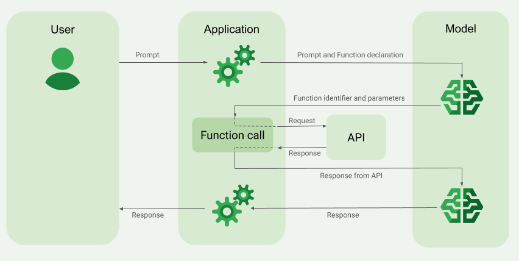

## The Evolution of Tool Calling in LLMs

### Introduction

Ever wondered how LLMs interact with external tools? Over time, tool integration has evolved from simple structured outputs to sophisticated function calling and even full-fledged execution environments like Python REPLs. In this blog, we explore the progression from early tool calling mechanisms to modern function calling and beyond.

### Version 1: Tool Calling

#### How It Worked
In early iterations, LLMs were prompted to output structured commands that an external script would parse and execute. For example, given the instruction:
```
Prompt to LLM: "You have a calculator tool to solve math problems.
Never attempt to solve math problems by yourself.
To use the calculator, format the output as 'Calculator, Operator, Operand1, Operand2'.
For example, to solve 2+3, please output 'Calculator, +, 2, 3'."
```

#### Example interaction:
```
User: Add 4 and 5.
LLM Output: Calculator, +, 4, 5.
External Script: Parses the response, executes the operation, and returns 9 to the user.
```

#### Problems with Tool Calling
- Inconsistent Formatting: LLMs often failed to produce properly formatted outputs, making parsing unreliable.
- Prompt Injection Attacks: Malicious inputs could manipulate the model into leaking tool execution details or performing unintended actions.
- Verbose Responses: LLMs sometimes generated unnecessary details instead of concise tool invocations.


### 2. Solution: Function Calling
A Framework for connecting llms to real-time data.



### 3. The Math Problem with GPT4 model:


### 4. 


