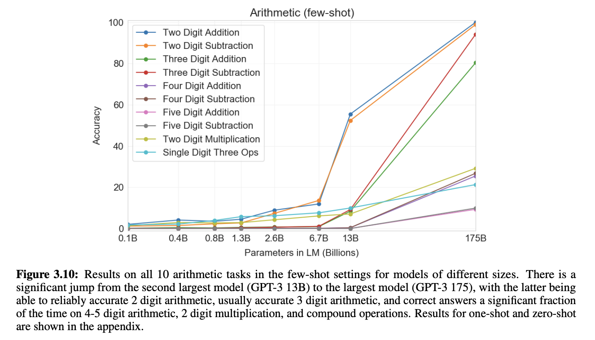
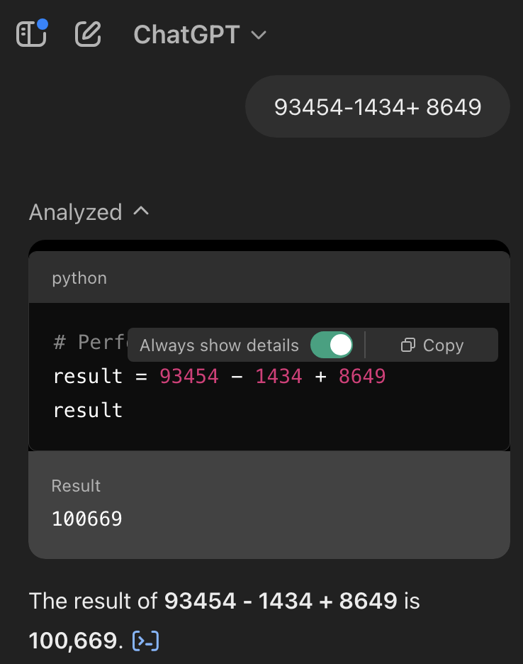

### Q) Ever wondered why one of the most popular tools — The Calculator — is essential for Large Language Models (LLMs)? 

While LLMs excel at natural language understanding, coding, and reasoning, they struggle with precise mathematical computations.

### 1. The Math Problem with GPT3 - 175B model:
Below graph from [Language Models are Few-Shot Learners" (Brown et al., 2020)](https://arxiv.org/pdf/2005.14165) research highlights the accuracy drop in arithmetic tasks with GPT3 - 175B model:  
 
- 2-digit addition/subtraction: 100% accuracy
  
- 3-digit addition/subtraction: 80% accuracy
  
- 4-digit arithmetic: 25% accuracy

- 5-digit arithmetic: 9% accuracy
 

#### Why does this happen? 
This demonstrates that even with scale, LLMs do not inherently develop rule-based mathematical reasoning but instead rely on statistical-patterns from training data.

### 2. The Math Problem with GPT4 model:
#### Solution: Tell LLMs to use external Math tools to solve Math problems. GPT4 model took the help of external tool i.e., in this case, it ran python code behind the scenes to compute a given simple addition arithmatic questoin as shown in hte image below

### Conclusion: LLMs are impressive, but they’re not built for precise arithmetic. That’s why the calculator remains one of the most essential tools for AI systems. By integrating external tools, we can combine the best of both worlds—leveraging LLMs’ natural language prowess while ensuring mathematical accuracy.
